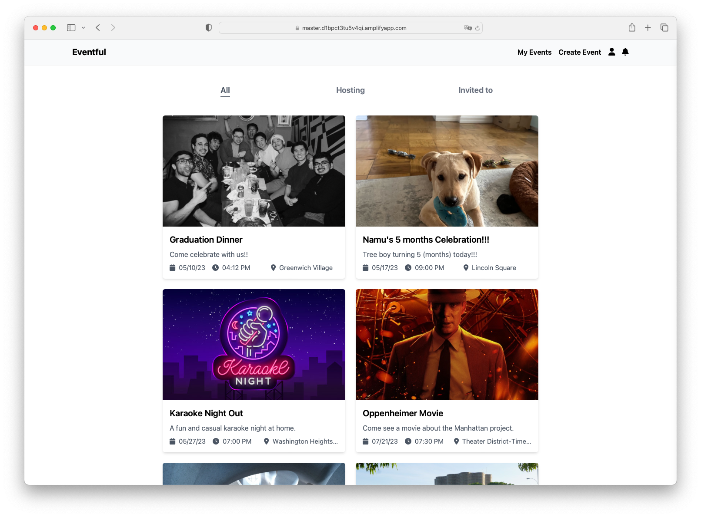
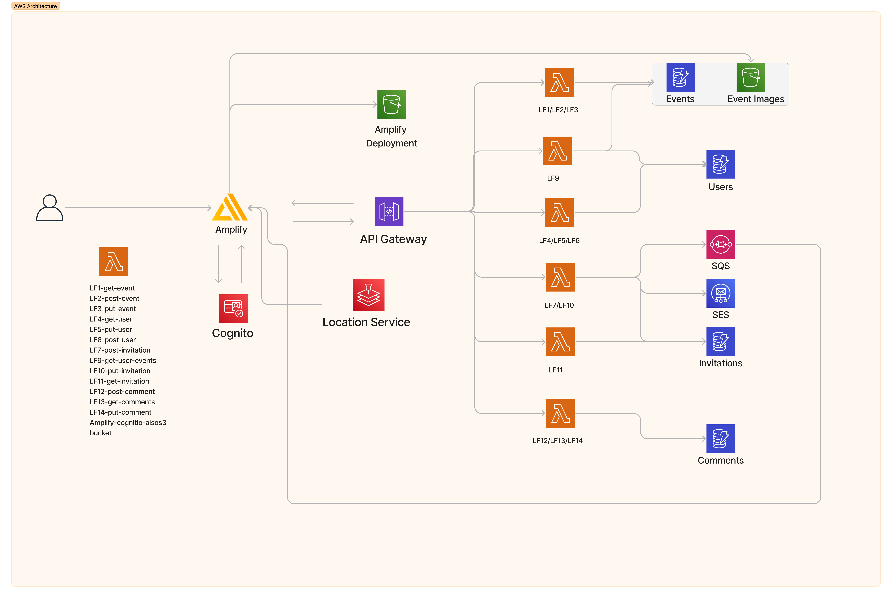
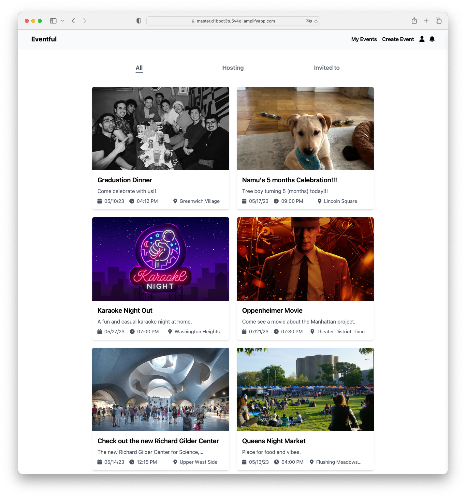
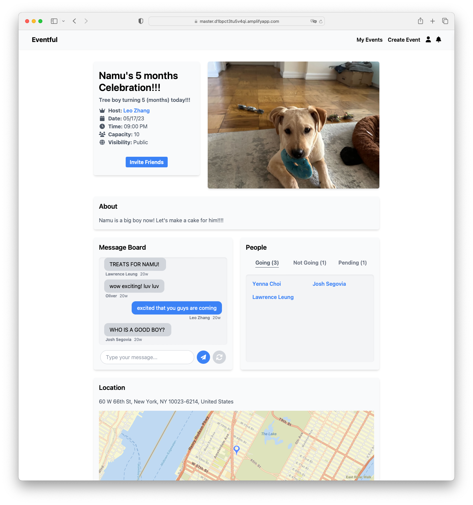
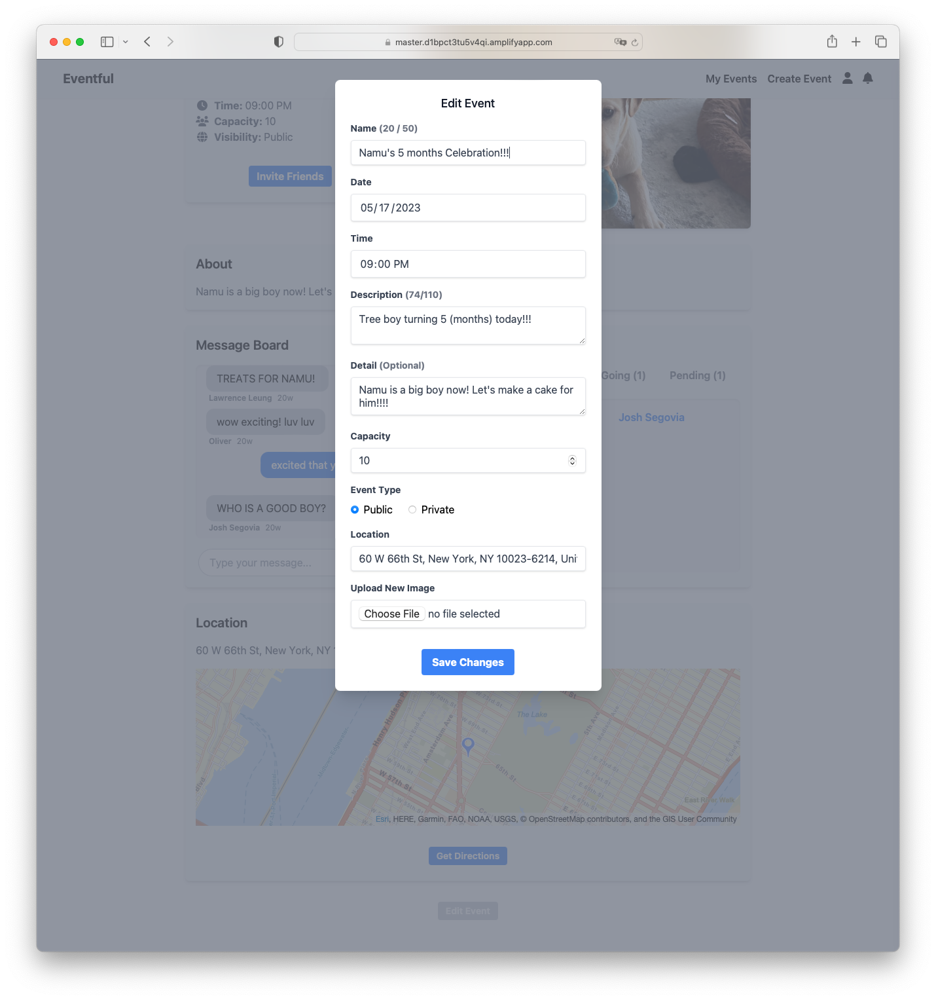

  <h1>Eventful Web App</h1>

  

    This web app is designed to elevate the process of creating, sharing, and attending events within social and professional circles. Unlike similar services, Eventful focuses on peer to peer event creation, simultaneously enabling seamless and efficient management while fostering interpersonal connections. It is built using React, Node.js, AWS Amplify,
    AWS Cognito, API Gateway, AWS Lambda, DynamoDB, and AWS SQS.
  

<h2>Video Demo</h2>

    

  <h2>System Design</h2>
  <h3>UI/UX Design</h3>
  <a
    href="https://www.figma.com/file/COJJUTUi74Wd3509OpcE3A/Low-fi-Prototype-V2?type=design&node-id=0%3A1&mode=design&t=LBJ793MfpAApPnes-1"
    target="_blank">Figma Wireframes</a>
  <h3>AWS Backend Architecture</h3>
    <a href="https://github.com/leozhvng23/event-webapp-backend" target="_blank">Backend Code</a>
    

<strong>Read about the system implementation here: </strong>
    <a
      href="./screenshots/system_paper.pdf"
      target="_new"
      ><strong>project report</strong></a
    >
    

  <h2>Screenshots</h2>
  

    
  

  

    
  

  

    
  

